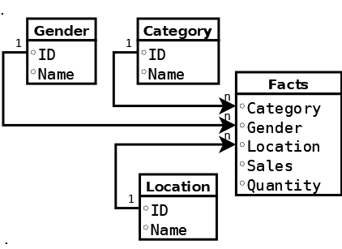

# NSimpleOLAP 

## Configuring a Cube

The preferred way for getting a Cube up and ready is through the fluent interface using the **CubeBuilder**.
This will expose the API that will enable granular configuration of each aspect of the Cube.

The aspects that can be configured are:
- Setting up Data Sources.
- Setting up mappings between Data Sources and Dimensions and Fact rows.
- Setting up metadata that defines dimensions and measures.
- Set what are the operational modes the Cube will use to process data.

### First Step, Modelling

Configuring the Cube will start by selecting which features from a data source you want to use, and if these will fit your desired goals.
And depending on that it will mean that the incoming data will need to be structured so that the aggregations aren't meaningless.

The usual example are spreadsheets with sales figures, these fit well as basic examples but are far from being the only use cases that are possible.

One other aspect is the **NSimpleOLAP** library has an internal model of a denormalized facts table with reference tables as the sources of metadata for the Cube dimensions.
And this will force the need to prepare the data before using in a Cube, since it won't consume the data in a raw format.



Your initial data can come from a *CSV* file with the following format, and where some of the columns reference a source table.

```text
category, gender, place, Date, expenses, items
1, 1, 2, 2021-01-15,1000.12, 30
2, 2, 2, 2021-03-05,200.50, 5
4, 2, 5, 2021-10-17,11500.00, 101
3, 2, 2, 2021-08-25,100.00, 20
2, 1, 6, 2021-02-27,10.10, 5
1, 2, 2, 2021-08-30,700.10, 36
5, 2, 5, 2021-12-15,100.40, 31
1, 1, 3, 2021-09-07,100.12, 12
3, 2, 3, 2021-06-01,10.12, 30
2, 2, 2, 2021-06-05,10000.12, 30
1, 2, 1, 2021-05-04,100.12, 1
4, 2, 2, 2021-01-03,10.12, 6
2, 2, 3, 2021-11-09,100.12, 44
1, 2, 3, 2021-07-01,10.12, 8
4, 1, 1, 2021-04-24,100.12, 5
1, 1, 6, 2021-06-02,10.12, 7
4, 3, 6, 2021-05-18,100.12, 30
2, 1, 2, 2021-08-21,60.99, 8
1, 2, 2, 2021-02-16,6000.00, 89
4, 3, 6, 2021-03-07,600.00, 75
1, 1, 6, 2021-01-01,10.00, 12
4, 2, 2, 2021-07-28,2000.00, 30
5, 2, 6, 2021-12-20,50.10, 11
3, 1, 3, 2021-06-08,130.50, 2
```

Source tables can be set on the following format.

```text
id, description
1, toys
2, clothes
3, furniture
4, shoes
5, Video Games
```

**NSimpleOLAP** also allows for adding data during runtime, but you will need to define your initial data.

### Setup a Data Source

The configuration fluent API will allow you to start building your Cube in any order that you wish, although you will need to be aware that there are mappings references between blocks.
With that in mind a good rule of thumb is to start with your data sources, NSimpleOLAP allows for the following sources:

- CSV files;
- SQL Databases;
- System.Data Data sets;
- Collections of POCOs.
 
At this stage *CSV* files have been tested more thoroughly, since these are a quick and easy way to get started and need very little setup for small data sets.

Data sources provide the feed for both Dimension data and for Facts, these will be required to build the aggregation cells.

```csharp

var builder = new CubeBuilder();

builder.AddDataSource(dsbuild =>
{
  dsbuild.SetName("sales")
	.SetSourceType(DataSourceType.CSV)
	.SetCSVConfig(csvbuild =>
	{
	  csvbuild.SetFilePath("TestData//facts.csv")
	  .SetHasHeader();
	})
	.AddField("category", 0, typeof(int))
	.AddField("expenses", 3, typeof(double))
	.AddField("items", 4, typeof(int));
})
.AddDataSource(dsbuild =>
{
  dsbuild.SetName("categories")
	.SetSourceType(DataSourceType.CSV)
	.AddField("id", 0, typeof(int))
	.AddField("description", 1, typeof(string))
	.SetCSVConfig(csvbuild =>
	{
	  csvbuild.SetFilePath("TestData//dimension1.csv")
	  .SetHasHeader();
	});
});

``` 

Also, data sources can be used to add new categories that are transforms of the initial data coming in the Facts table.

```csharp

builder.AddDataSource(dsbuild =>
{
  dsbuild.SetName("brackets")
	.SetSourceType(DataSourceType.Transformer)
	.SetTransformerTableConfig(transfbuild =>
	{
	  transfbuild
		.AddIntervalSegment("Small Purchase", 0, 20)
		.AddIntervalSegment("Medium Purchase", 21, 50)
		.AddIntervalSegment("Large Purchase", 51, null);
	});
});

``` 

This allows you to add a categoric dimension that is built around continuous data, which can be age to build age groups, or wage data to set wage brackets. And in this way being able to get more insights from the base data.
 
### Setup Metadata

In the metadata section your will be able to define the dimensions and measures that will be added to the Cube.

```csharp

builder.MetaData(mbuild =>
{
  mbuild.AddDimension("category", (dimbuild) =>
  {
	dimbuild.Source("categories")
	  .ValueField("id")
	  .DescField("description");
  })
  .AddMeasure("quantity", mesbuild =>
  {
	mesbuild.ValueField("items")
	  .SetType(typeof(int));
  });
});
``` 

All the dimensions either coming from data sources or generated need to be added into this section. Like this example using the definition of purchasing brackets from the above data sources section.

```csharp

builder.MetaData(mbuild =>
{
  mbuild.AddDimension("purchase_size", dimbuild =>
  {
	dimbuild
	  .Source("brackets")
	  .SetSourceMembersAreGenerated();
  });
});
``` 

### Setup the Source Mappings

This section will map the dimensions to the Facts data source, and once this step is done you can attempt to initialize the cube and start exploring.

```csharp

builder.SetSourceMappings((sourcebuild) =>
  sourcebuild.SetSource("sales")
  .AddMapping("category", "category")
  .AddMapping("items", "purchase_size")
);
``` 